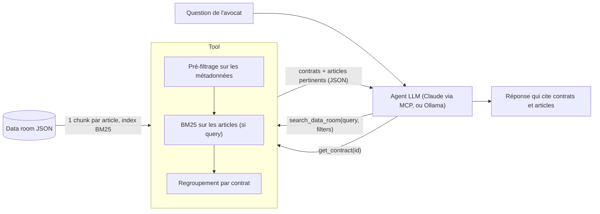

# data-room-search — recherche dans une data room de contrats

Un **tool** qu'un agent LLM appelle pour répondre aux questions d'un avocat sur une data room (« Quels contrats avec le Groupe Brenalis expirent avant fin 2026 ? », « Lesquels sont régis par un droit étranger ? », « Y a-t-il des doublons ? »). Il est exposé en **serveur MCP**, donc utilisable depuis Claude (Desktop, Code ou claude.ai) ou tout autre client MCP. Un agent de démonstration sur LLM local (Ollama) est aussi fourni.

Le repo est livré avec une data room **fictive** de 20 contrats (voir [Données](#données)) ; une vraie en contiendrait des milliers.

## Démarrage rapide

Prérequis : Python ≥ 3.10.

```bash
python -m venv .venv && source .venv/bin/activate
pip install -e ".[dev]"

pytest                                    # 31 tests, sans LLM (serveur MCP compris)
python -m dataroom.indexer                # 20 contrats, 106 articles indexés
bash scripts/run_query.sh "exclusivité territoriale"          # le tool seul, sortie JSON

claude mcp add dataroom -- "$PWD/.venv/bin/dataroom-mcp"      # le brancher à Claude Code (autres clients : ci-dessous)
python -m dataroom.mcp_server --http      # ou en HTTP : http://127.0.0.1:8002/mcp
uvicorn dataroom.api:app --port 8001      # API REST : GET /tools, POST /tools/search_data_room, /tools/get_contract, /ask
```

**Optionnel : agent local.** Avec [Ollama](https://ollama.com) et un modèle qui gère l'appel de tools : `python -m dataroom.agent "Lesquels sont régis par un droit étranger ?"`. Testé avec `huihui_ai/qwen3.5-abliterated:27b` (35 à 90 s par question sur un M1 Pro 32 Go) ; un autre modèle devrait fonctionner mais n'a pas été testé : `DATAROOM_MODEL=<modèle>` ou `--model`. Configuration complète dans [`dataroom/config.py`](dataroom/config.py) (`DATAROOM_DATA`, `DATAROOM_MODEL`, `OLLAMA_URL`, `DATAROOM_MCP_TOKEN`).

## Brancher un client MCP

N'importe quel client MCP (Claude Desktop, Claude Code, Cursor, un agent maison) peut appeler `search_data_room` et `get_contract`. C'est le même contrat que l'API REST et l'agent Ollama : les trois s'appuient sur `tool_definitions()` et `run_tool()` de [`dataroom/tools.py`](dataroom/tools.py).

**En local, en stdio** : la commande `dataroom-mcp`, installée par `pip install -e .`, lance le serveur sans argument.

```bash
claude mcp add dataroom -- /chemin/vers/data-room-search/.venv/bin/dataroom-mcp     # Claude Code
```

Pour Claude Desktop : dans les réglages de l'application, section Développeur, modifier la configuration (`claude_desktop_config.json`), puis redémarrer l'application.

```json
{
  "mcpServers": {
    "dataroom": {
      "command": "/chemin/vers/data-room-search/.venv/bin/dataroom-mcp"
    }
  }
}
```

**En HTTP** (Streamable HTTP, sans état, réponses JSON) : lancer `python -m dataroom.mcp_server --http`, puis :

```bash
claude mcp add --transport http dataroom http://127.0.0.1:8002/mcp     # Claude Code

curl -s -X POST http://127.0.0.1:8002/mcp \
  -H 'Content-Type: application/json' -H 'Accept: application/json, text/event-stream' \
  -d '{"jsonrpc": "2.0", "id": 1, "method": "tools/call", "params": {"name": "search_data_room",
       "arguments": {"filters": {"governing_law": {"not_in": ["droit français"]}}}}}'
```

**Sécurité.** Par défaut, le serveur n'écoute qu'en local et rejette les requêtes dont l'en-tête Host est étranger (protection contre le DNS rebinding). Pour l'ouvrir au réseau, un jeton est obligatoire ; sans jeton, le serveur refuse de démarrer.

```bash
DATAROOM_MCP_TOKEN=<secret> python -m dataroom.mcp_server --http --host 0.0.0.0
claude mcp add --transport http dataroom http://<hôte>:8002/mcp --header "Authorization: Bearer <secret>"
```

En production, il faudrait ajouter HTTPS (reverse proxy) et, pour plusieurs utilisateurs, OAuth, que le SDK MCP prend en charge.

Testé avec :
- le client MCP officiel en Python (in-process, stdio, HTTP) ;
- le MCP Inspector, en TypeScript (stdio et HTTP) ;
- Claude Code avec un vrai LLM (stdio) : il appelle `search_data_room` avec les bons filtres et cite les contrats ;
- `curl`, y compris sur l'URL HTTPS publique du tunnel (liste des tools, appel réel, et 404 sans le chemin secret) ;
- le connecteur personnalisé de Claude, via le tunnel.

Claude Desktop utilise le même mécanisme stdio que Claude Code.

**Via le connecteur personnalisé de Claude** (Desktop ou claude.ai), qui exige une URL HTTPS publique : `bash scripts/mcp_tunnel.sh` ouvre un tunnel Cloudflare gratuit et sans compte (`brew install cloudflared`), lance le serveur derrière un chemin secret, puis affiche l'URL à coller dans Claude.
- Le chemin secret sert de clé, car le connecteur ne transmet pas de jeton : ne partage pas l'URL.
- Seul le domaine du tunnel est accepté, en plus de localhost.
- L'URL change à chaque lancement et ne fonctionne que tant que le script tourne.
- Avec des données réelles, ce tunnel les rend accessibles à quiconque a l'URL : à réserver au jeu fictif.

## Données

- **`data/exemple_data_room.json`** : data room **fictive**, écrite à la main. Elle contient 20 contrats d'une due diligence imaginaire sur le « Groupe Brenalis ».
  - On y retrouve les difficultés typiques d'une vraie data room : doublons (fichier téléversé deux fois, traduction de courtoisie), avenant qui reporte le terme d'un contrat, métadonnées manquantes ou contredites par le texte, droit étranger, noms proches désignant des entités différentes.
  - Les noms, les textes, les dates et les montants sont inventés. Les SIREN sont volontairement invalides au sens de la clé de Luhn : ils ne peuvent correspondre à aucune entreprise réelle.
- **Données réelles** : à placer dans `private/`, exclu de git, puis `DATAROOM_DATA=private/<fichier>.json`. Sans cette variable, seul le jeu fictif est utilisé.

Rien n'est codé en dur pour une data room donnée : les entités, types de contrat et lois possibles sont tirés des données chargées. Les tests tournent sur le jeu fictif.

## Architecture



**1. Réception de la demande.** L'agent reformule la question en paramètres structurés, validés par Pydantic. Les valeurs possibles (entités, types, lois) sont tirées de la data room chargée et proposées au LLM dans le schéma du tool ; une valeur inconnue est rejetée avec la liste des valeurs possibles. Les dates sont absolues : c'est l'agent qui convertit « fin 2026 ».

```json
{
  "query": "texte libre, optionnel",
  "filters": {
    "entity_ids": ["groupe_brenalis"],
    "contract_types": ["bail commercial"],
    "governing_law": {"in": [], "not_in": ["droit français"]},
    "signature_date": {"after": "2023-01-01", "before": null},
    "end_date": {"after": null, "before": "2026-12-31"}
  },
  "top_k": 10
}
```

**2. Indexation.** Chaque contrat est découpé par article (`ARTICLE n — TITRE`). Le titre, les parties et le type du contrat sont indexés avec chaque article, pour qu'un article isolé reste compréhensible. Index BM25 en mémoire (quelques millisecondes à construire).

**3. Recherche.** Filtrage sur les métadonnées, puis deux cas :
- sans `query` → **tous** les contrats qui passent les filtres : une question « lesquels ? » exige une réponse exhaustive ;
- avec `query` → classement BM25 des articles ; le score d'un contrat est celui de son meilleur article.

**4. Sortie.** Pour chaque contrat : les filtres satisfaits et les articles qui justifient le résultat, que l'agent cite. Un contrat dont le champ filtré est vide n'est **jamais écarté en silence** : il est listé dans `excluded_unknown`.

```json
{
  "total_candidates": 2,
  "excluded_unknown": ["c08", "c17"],
  "results": [{
    "contract_id": "c04",
    "title": "Lettre de mission d'audit d'acquisition — Cabinet Morand / Groupe Brenalis",
    "end_date": "2026-11-30",
    "governing_law": "droit français",
    "matched_filters": ["parties: groupe_brenalis", "fin 2026-11-30 (<= 2026-12-31)"],
    "relevant_articles": [{
      "chunk_id": "c04-2",
      "heading": "ARTICLE 2 — DURÉE",
      "excerpt": "La mission commence le 1er décembre 2025 et s'achève au plus tard le 30 novembre 2026, date de remise du rapport définitif."
    }]
  }]
}
```

## Choix et compromis

- **Pas un RAG classique.** Un RAG qui renvoie les k passages les plus proches échoue sur ces questions : « lesquels ? » demande l'exhaustivité, « droit étranger » demande un filtre (« droit français » et « droit suisse » sont presque identiques pour un moteur de similarité). Le tool est donc hybride : requête structurée pour les listes, recherche plein texte pour le contenu des clauses.
- **L'agent interprète, le tool reste déterministe.** Le LLM traduit le langage naturel (dates relatives, « droit étranger » = `not_in: ["droit français"]`). Le tool valide strictement ses entrées et renvoie les erreurs au modèle pour qu'il corrige son appel.
- **BM25 d'abord.** Simple, explicable, sans dépendance. Les embeddings pourront être ajoutés dans `search.py` (fusion par rang) sans changer les formats d'entrée et de sortie.
- **LLM local possible.** Une data room est confidentielle : un modèle local évite d'envoyer les contrats à un tiers. Pour un petit modèle, le schéma des tools est aplati (pas de `$ref` ni d'`anyOf`).
- **Aucune data room codée en dur.** Les valeurs possibles des filtres viennent des données chargées : le même code sert n'importe quelle data room.

## Résultats

| Question | Réponse du tool | Signalés à part |
|---|---|---|
| Contrats Brenalis qui expirent avant fin 2026 | c04, c09 (article DURÉE) | c08, c17 : pas de date de fin ; c12 (Brénalys Advisory) exclu |
| Contrats régis par un droit étranger | c05 (new-yorkais) et c20, sa traduction de courtoisie ; c16 (suisse) | c10 : loi non renseignée |
| « exclusivité territoriale » | c03, ARTICLE 4 — EXCLUSIVITÉ | — |
| « franchise » | c13, alors que ses métadonnées le typent « contrat de licence » | — |

Trace complète de l'agent sur les questions types : [`docs/demo.md`](docs/demo.md) (régénérable avec `python scripts/demo.py`).

## Limites connues

- **c09 est un faux positif** pour Brenalis : l'avenant c18 reporte son terme au 30/06/2028. Le lien avenant → contrat n'est pas modélisé.
- **Pas de tool dédié aux doublons** ({c11, c19} : la même convention téléversée deux fois ; {c05, c20} : un contrat et sa traduction de courtoisie). L'agent peut les repérer en demandant la liste complète et en comparant parties, types et dates, mais avec des milliers de contrats cette liste ne tiendrait pas dans son contexte : il faut un traitement dédié.
- **Qualité des données** laissée de côté volontairement : normalisation minimale (dates, SIREN, noms d'entités), pas de détection des contradictions entre métadonnées et texte (c15 : fin au 31/03/2027 dans les métadonnées, au 30/09/2026 dans le texte).
- **Bruit sur les requêtes texte** : aucun seuil de pertinence, et le préfixe titre/type fait remonter des contrats dont seul le titre correspond.
- **Identifiants d'entités tirés du nom normalisé.** Deux écritures vraiment différentes d'une même société (sigle, faute de frappe) ne sont pas rapprochées. C'est voulu, pour éviter les fusions approximatives, mais à grande échelle il faudrait un tool de résolution des parties.

## Prochaines étapes

Relier les avenants à leur contrat et ajouter un tool de doublons ; ajouter un seuil de pertinence et les embeddings ; mesurer chaque changement sur un jeu de questions annoté par des juristes.

## Structure

```
├── data/exemple_data_room.json   jeu fictif
├── dataroom/
│   ├── config.py      configuration (variables d'environnement)
│   ├── models.py      schémas d'entrée et de sortie du tool
│   ├── loader.py      chargement et normalisation du JSON
│   ├── indexer.py     découpage par article, BM25
│   ├── search.py      filtres, classement, articles pertinents
│   ├── tools.py       définitions des tools et exécution
│   ├── agent.py       boucle agent avec Ollama, CLI
│   ├── api.py         API FastAPI
│   └── mcp_server.py  serveur MCP (stdio et HTTP)
├── scripts/           run_query.sh (tool seul), demo.py (agent sur des questions types), mcp_tunnel.sh (URL HTTPS pour Claude)
├── docs/demo.md       trace de la démo, sur le jeu fictif
├── tests/             un fichier par module, sur le jeu fictif ; l'agent est testé avec un faux LLM
├── .github/workflows/ CI : les tests sur Python 3.10 et 3.14
└── private/           non versionné : données réelles et notes locales
```

## Méthode de travail

Développé avec Claude Code. Les choix d'architecture ont été discutés et arbitrés au fil de la session : mettre la qualité des données de côté, construire le format de la demande et la sortie avant le reste, BM25 avant les embeddings, LLM local. [`CLAUDE.md`](CLAUDE.md) en garde la trace.
